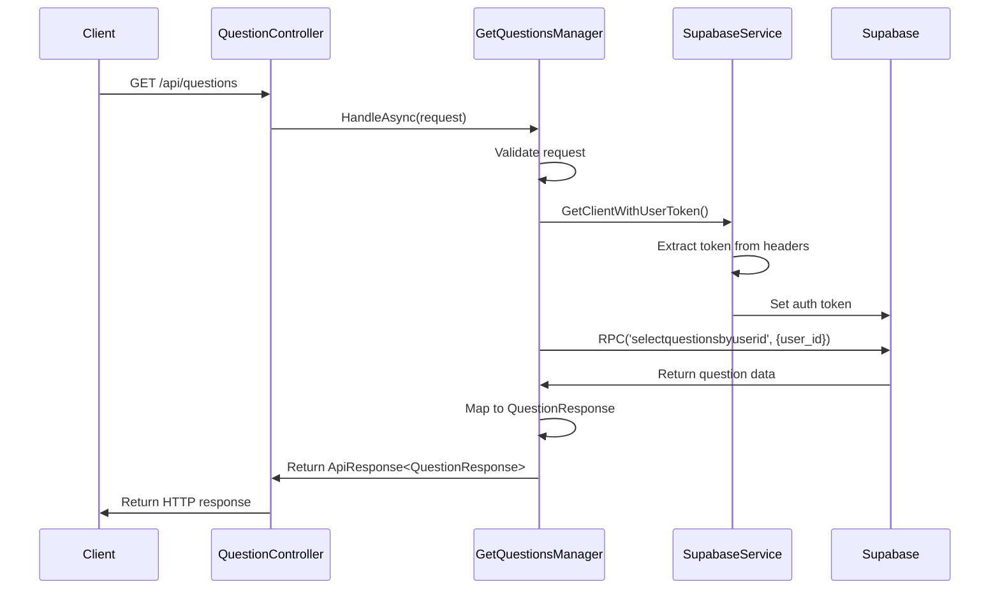
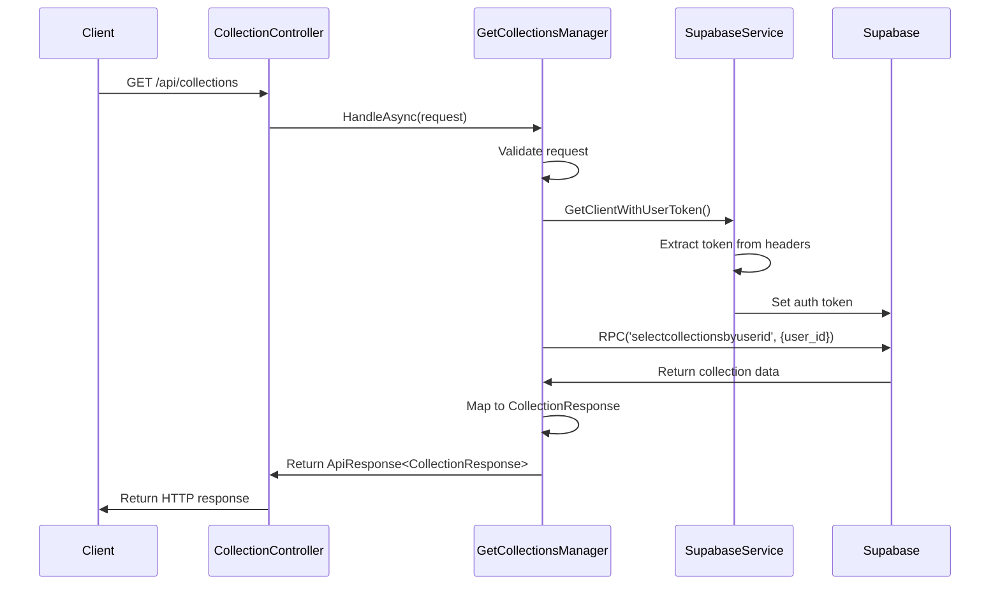

# C# .NET API Plan for Supabase Integration

## Implementation To-Do List

- [x] Define project structure and architecture
- [x] Identify required dependencies
- [x] Define configuration structure
- [x] Design authentication implementation
- [x] Define API endpoints
- [x] Design core service implementation
- [x] Design manager pattern
- [x] Design request validation approach
- [x] Create example flows for key endpoints
- [x] Define error handling strategy
- [x] Define testing strategy
- [x] Document deployment considerations
- [x] Document performance optimization strategies
- [x] Define API contracts
- [x] Set up project and folder structure
- [x] Configure dependencies in .csproj
- [x] Create appsettings.json with Supabase credentials
- [x] Implement SupabaseService
- [x] Configure JWT authentication
- [x] Implement user context middleware
- [x] Implement AuthController and AuthManager
- [x] Implement ProfileController and ProfileManager
- [x] Implement QuestionController and QuestionManager
- [x] Implement CollectionController and CollectionManager
- [x] Implement UserQuestionController and UserQuestionManager
- [x] Implement StreakController and StreakManager
- [x] Implement global exception middleware
- [x] Set up logging with Serilog
- [ ] Write unit tests for managers and services
- [ ] Write integration tests for Supabase interactions
- [x] Configure Swagger/OpenAPI documentation
- [ ] Set up CI/CD pipeline
- [x] Implement health checks
- [x] Configure CORS policy

## 1. Project Overview
- Create a C# .NET API that acts as a pass-through to Supabase database
- Implement authentication using Supabase JWT
- Follow resource-oriented design principles
- Maintain consistent response formats

## 2. Project Structure

### Controllers (Resource-Oriented)
- `AuthController`: Authentication operations
- `ProfileController`: User profile operations
- `QuestionController`: Question-related operations
- `CollectionController`: Collection-related operations
- `UserQuestionController`: User question attempts and solutions

### Services
- `SupabaseService`: Core service for Supabase client initialization and management
- `AuthService`: Handle authentication operations
- `StorageService`: Handle file operations with Supabase storage

### Managers
- `AuthManager`: Validates auth requests and orchestrates auth operations
- `ProfileManager`: Validates profile requests and orchestrates profile operations
- `QuestionManager`: Validates question requests and orchestrates question operations
- `CollectionManager`: Validates collection requests and orchestrates collection operations
- `UserQuestionManager`: Validates user question requests and orchestrates user question operations

### Models
- Request/response DTOs matching frontend TypeScript interfaces
- Internal models for business logic

## 3. Dependencies
```xml
<ItemGroup>
  <PackageReference Include="supabase-csharp" Version="0.13.6" />
  <PackageReference Include="Microsoft.AspNetCore.Authentication.JwtBearer" Version="8.0.0" />
  <PackageReference Include="Swashbuckle.AspNetCore" Version="6.5.0" />
  <PackageReference Include="FluentValidation.AspNetCore" Version="11.3.0" />
</ItemGroup>
```

## 4. Configuration
```json
{
  "Supabase": {
    "Url": "YOUR_SUPABASE_URL",
    "AnonKey": "YOUR_SUPABASE_ANON_KEY",
    "ServiceKey": "YOUR_SUPABASE_SERVICE_KEY",
    "JwtSecret": "YOUR_SUPABASE_JWT_SECRET"
  },
  "Cors": {
    "AllowedOrigins": ["http://localhost:3000", "https://your-production-domain.com"]
  }
}
```

## 5. Authentication Implementation

### JWT Configuration
```csharp
services.AddAuthentication(JwtBearerDefaults.AuthenticationScheme)
    .AddJwtBearer(options =>
    {
        options.TokenValidationParameters = new TokenValidationParameters
        {
            ValidateIssuerSigningKey = true,
            IssuerSigningKey = new SymmetricSecurityKey(
                Encoding.UTF8.GetBytes(Configuration["Supabase:JwtSecret"])),
            ValidateIssuer = true,
            ValidIssuer = Configuration["Supabase:Url"] + "/auth/v1",
            ValidateAudience = false,
            ValidateLifetime = true,
            ClockSkew = TimeSpan.Zero
        };
    });
```

### User Context Middleware
- Extract user ID from JWT claims
- Add user context to HTTP context for controllers

## 6. API Endpoints

### Auth Endpoints
- `POST /api/auth/signup` - Email/password signup
- `POST /api/auth/signin` - Email/password login
- `POST /api/auth/google` - Google OAuth login
- `POST /api/auth/apple` - Apple OAuth login
- `POST /api/auth/signout` - Sign out

### Profile Endpoints
- `GET /api/profile` - Get user profile
- `PUT /api/profile` - Update user profile

### Question Endpoints
- `GET /api/questions` - Get all questions for user
- `GET /api/questions/{id}` - Get question by ID
- `GET /api/questions/data/{id}` - Get question data from storage

### Collection Endpoints
- `GET /api/collections` - Get all collections for user
- `GET /api/collections/{id}` - Get collection by ID
- `POST /api/collections` - Create new collection
- `PUT /api/collections/{id}` - Update collection
- `DELETE /api/collections/{id}` - Delete collection

### User Question Endpoints
- `GET /api/userquestions/{questionId}` - Get user question attempt
- `POST /api/userquestions/{questionId}` - Create user question attempt
- `GET /api/userquestions/data/{userQuestionId}` - Get user question data
- `PUT /api/userquestions/data/{userQuestionId}` - Update user question data

### Streak Endpoints
- `GET /api/streaks` - Get user's weekly streak
- `PUT /api/streaks` - Update user's streak

## 7. Core Service Implementation

### SupabaseService
```csharp
public class SupabaseService
{
    private readonly Supabase.Client _client;
    private readonly IHttpContextAccessor _httpContextAccessor;

    public SupabaseService(IConfiguration configuration, IHttpContextAccessor httpContextAccessor)
    {
        _httpContextAccessor = httpContextAccessor;
        var url = configuration["Supabase:Url"];
        var key = configuration["Supabase:AnonKey"];
        var options = new Supabase.SupabaseOptions
        {
            AutoRefreshToken = true,
            AutoConnectRealtime = false
        };
        _client = new Supabase.Client(url, key, options);
    }

    public async Task<Supabase.Client> GetClientWithUserToken()
    {
        var token = _httpContextAccessor.HttpContext.Request.Headers["Authorization"]
            .FirstOrDefault()?.Split(" ").Last();
        
        if (!string.IsNullOrEmpty(token))
        {
            await _client.Auth.SetAuth(token);
        }
        
        return _client;
    }
}
```

## 8. Manager Implementation

### Manager Pattern
```csharp
public interface IManager<TRequest, TResponse> where TResponse : class
{
    Task<ApiResponse<TResponse>> HandleAsync(TRequest request);
}

public abstract class BaseManager<TRequest, TResponse> : IManager<TRequest, TResponse> 
    where TResponse : class
{
    protected readonly IValidator<TRequest> _validator;
    
    protected BaseManager(IValidator<TRequest> validator)
    {
        _validator = validator;
    }
    
    public async Task<ApiResponse<TResponse>> HandleAsync(TRequest request)
    {
        // Validate request
        var validationResult = await _validator.ValidateAsync(request);
        if (!validationResult.IsValid)
        {
            return new ApiResponse<TResponse>
            {
                Success = false,
                Error = "Validation failed",
                ErrorCode = "VALIDATION_ERROR",
                ValidationErrors = validationResult.Errors.Select(e => new ValidationError
                {
                    PropertyName = e.PropertyName,
                    ErrorMessage = e.ErrorMessage
                }).ToList()
            };
        }
        
        // Process request
        try
        {
            var result = await ProcessRequestAsync(request);
            return new ApiResponse<TResponse>
            {
                Success = true,
                Data = result
            };
        }
        catch (Exception ex)
        {
            return HandleException<TResponse>(ex);
        }
    }
    
    protected abstract Task<TResponse> ProcessRequestAsync(TRequest request);
    
    protected ApiResponse<T> HandleException<T>(Exception ex) where T : class
    {
        // Log exception
        
        return new ApiResponse<T>
        {
            Success = false,
            Error = "An error occurred while processing your request",
            ErrorCode = "INTERNAL_SERVER_ERROR",
            TraceId = Activity.Current?.Id ?? HttpContext.TraceIdentifier
        };
    }
}
```

### Example Manager Implementation
```csharp
public class SignInManager : BaseManager<SignInRequest, AuthResponse>
{
    private readonly AuthService _authService;
    
    public SignInManager(
        IValidator<SignInRequest> validator,
        AuthService authService) : base(validator)
    {
        _authService = authService;
    }
    
    protected override async Task<AuthResponse> ProcessRequestAsync(SignInRequest request)
    {
        // Call Supabase auth service
        var result = await _authService.SignInWithEmailAsync(request.Email, request.Password);
        
        // Map to response
        return new AuthResponse
        {
            Data = result.Data != null ? new AuthResponse.UserData
            {
                User = new AuthResponse.User
                {
                    Id = result.Data.User.Id,
                    Email = result.Data.User.Email
                },
                AccessToken = result.Data.AccessToken,
                RefreshToken = result.Data.RefreshToken
            } : null,
            Error = result.Error
        };
    }
}
```

## 9. Request Validation

### FluentValidation Implementation
```csharp
public class SignInRequestValidator : AbstractValidator<SignInRequest>
{
    public SignInRequestValidator()
    {
        RuleFor(x => x.Email)
            .NotEmpty().WithMessage("Email is required")
            .EmailAddress().WithMessage("Email is not in a valid format");
            
        RuleFor(x => x.Password)
            .NotEmpty().WithMessage("Password is required")
            .MinimumLength(8).WithMessage("Password must be at least 8 characters");
    }
}
```

### Controller Implementation with Manager
```csharp
[ApiController]
[Route("api/[controller]")]
public class AuthController : ControllerBase
{
    private readonly IManager<SignUpRequest, AuthResponse> _signUpManager;
    private readonly IManager<SignInRequest, AuthResponse> _signInManager;
    
    public AuthController(
        IManager<SignUpRequest, AuthResponse> signUpManager,
        IManager<SignInRequest, AuthResponse> signInManager)
    {
        _signUpManager = signUpManager;
        _signInManager = signInManager;
    }
    
    [HttpPost("signin")]
    public async Task<IActionResult> SignIn([FromBody] SignInRequest request)
    {
        var response = await _signInManager.HandleAsync(request);
        return response.Success ? Ok(response) : BadRequest(response);
    }
    
    [HttpPost("signup")]
    public async Task<IActionResult> SignUp([FromBody] SignUpRequest request)
    {
        var response = await _signUpManager.HandleAsync(request);
        return response.Success ? Ok(response) : BadRequest(response);
    }
}
```

## 10. Example Flows

### GET /api/questions Flow

#### 1. Request Processing Flow


#### 2. Code Implementation

**QuestionController**
```csharp
[ApiController]
[Route("api/[controller]")]
[Authorize]
public class QuestionController : ControllerBase
{
    private readonly IManager<EmptyRequest, QuestionResponse> _getQuestionsManager;
    
    public QuestionController(IManager<EmptyRequest, QuestionResponse> getQuestionsManager)
    {
        _getQuestionsManager = getQuestionsManager;
    }
    
    [HttpGet]
    public async Task<IActionResult> GetQuestions()
    {
        // EmptyRequest since we're just using the authenticated user's ID
        var request = new EmptyRequest();
        var response = await _getQuestionsManager.HandleAsync(request);
        return response.Success ? Ok(response) : BadRequest(response);
    }
}
```

**GetQuestionsManager**
```csharp
public class GetQuestionsManager : BaseManager<EmptyRequest, QuestionResponse>
{
    private readonly SupabaseService _supabaseService;
    private readonly IHttpContextAccessor _httpContextAccessor;
    
    public GetQuestionsManager(
        IValidator<EmptyRequest> validator,
        SupabaseService supabaseService,
        IHttpContextAccessor httpContextAccessor) : base(validator)
    {
        _supabaseService = supabaseService;
        _httpContextAccessor = httpContextAccessor;
    }
    
    protected override async Task<QuestionResponse> ProcessRequestAsync(EmptyRequest request)
    {
        // Get authenticated user ID from claims
        var userId = _httpContextAccessor.HttpContext.User.FindFirst(ClaimTypes.NameIdentifier)?.Value;
        if (string.IsNullOrEmpty(userId))
        {
            throw new UnauthorizedAccessException("User ID not found in token");
        }
        
        // Get Supabase client with user token
        var client = await _supabaseService.GetClientWithUserToken();
        
        // Call Supabase RPC function
        var result = await client.Rpc<List<QuestionDto>>("selectquestionsbyuserid", new Dictionary<string, object>
        {
            { "p_user_id", userId }
        });
        
        if (result.Error != null)
        {
            throw new Exception($"Error calling Supabase: {result.Error.Message}");
        }
        
        // Map to response
        return new QuestionResponse
        {
            Data = result.Data?.Select(q => new QuestionResponse.Question
            {
                QuestionId = q.QuestionId,
                Title = q.Title,
                Difficulty = q.Difficulty,
                IsSolved = q.IsSolved,
                DesignPatterns = q.DesignPatterns
            }).ToList(),
            Error = null
        };
    }
}
```

**EmptyRequest and Validator**
```csharp
public class EmptyRequest
{
    // No properties needed
}

public class EmptyRequestValidator : AbstractValidator<EmptyRequest>
{
    public EmptyRequestValidator()
    {
        // No validation rules needed
    }
}
```

### GET /api/collections Flow

#### 1. Request Processing Flow


#### 2. Code Implementation

**CollectionController**
```csharp
[ApiController]
[Route("api/[controller]")]
[Authorize]
public class CollectionController : ControllerBase
{
    private readonly IManager<EmptyRequest, CollectionResponse> _getCollectionsManager;
    
    public CollectionController(IManager<EmptyRequest, CollectionResponse> getCollectionsManager)
    {
        _getCollectionsManager = getCollectionsManager;
    }
    
    [HttpGet]
    public async Task<IActionResult> GetCollections()
    {
        // EmptyRequest since we're just using the authenticated user's ID
        var request = new EmptyRequest();
        var response = await _getCollectionsManager.HandleAsync(request);
        return response.Success ? Ok(response) : BadRequest(response);
    }
}
```

**GetCollectionsManager**
```csharp
public class GetCollectionsManager : BaseManager<EmptyRequest, CollectionResponse>
{
    private readonly SupabaseService _supabaseService;
    private readonly IHttpContextAccessor _httpContextAccessor;
    
    public GetCollectionsManager(
        IValidator<EmptyRequest> validator,
        SupabaseService supabaseService,
        IHttpContextAccessor httpContextAccessor) : base(validator)
    {
        _supabaseService = supabaseService;
        _httpContextAccessor = httpContextAccessor;
    }
    
    protected override async Task<CollectionResponse> ProcessRequestAsync(EmptyRequest request)
    {
        // Get authenticated user ID from claims
        var userId = _httpContextAccessor.HttpContext.User.FindFirst(ClaimTypes.NameIdentifier)?.Value;
        if (string.IsNullOrEmpty(userId))
        {
            throw new UnauthorizedAccessException("User ID not found in token");
        }
        
        // Get Supabase client with user token
        var client = await _supabaseService.GetClientWithUserToken();
        
        // Call Supabase RPC function
        var result = await client.Rpc<List<CollectionDto>>("selectcollectionsbyuserid", new Dictionary<string, object>
        {
            { "p_user_id", userId }
        });
        
        if (result.Error != null)
        {
            throw new Exception($"Error calling Supabase: {result.Error.Message}");
        }
        
        // Map to response
        return new CollectionResponse
        {
            Data = result.Data?.Select(c => new CollectionResponse.Collection
            {
                CollectionId = c.CollectionId,
                CollectionName = c.CollectionName,
                IsDefault = c.IsDefault
            }).ToList(),
            Error = null
        };
    }
}
```

**Data Transfer Objects**
```csharp
public class CollectionDto
{
    [JsonProperty("collection_id")]
    public string CollectionId { get; set; } = string.Empty;
    
    [JsonProperty("collection_name")]
    public string CollectionName { get; set; } = string.Empty;
    
    [JsonProperty("is_default")]
    public bool IsDefault { get; set; }
    
    [JsonProperty("user_id")]
    public string? UserId { get; set; }
    
    [JsonProperty("default_collection_id")]
    public string? DefaultCollectionId { get; set; }
}

public class QuestionDto
{
    [JsonProperty("question_id")]
    public string QuestionId { get; set; } = string.Empty;
    
    [JsonProperty("title")]
    public string Title { get; set; } = string.Empty;
    
    [JsonProperty("difficulty")]
    public string Difficulty { get; set; } = string.Empty;
    
    [JsonProperty("is_solved")]
    public bool IsSolved { get; set; }
    
    [JsonProperty("design_patterns")]
    public List<string>? DesignPatterns { get; set; }
}
```

## 11. Error Handling
- Global exception middleware
- Standardized error response format
- Logging with Serilog

## 12. Testing Strategy
- Unit tests for services and controllers
- Integration tests for Supabase interactions
- Authentication flow tests

## 13. Deployment Considerations
- Environment-specific configurations
- Secrets management
- CORS policy for frontend access
- Health checks and monitoring

## 14. Performance Optimizations
- Response caching for frequently accessed data
- Asynchronous operations
- Connection pooling

## 15. API Contracts

### Auth Contracts

#### SignUp Request
```csharp
public class SignUpRequest
{
    [Required]
    [EmailAddress]
    public string Email { get; set; } = string.Empty;
    
    [Required]
    [MinLength(8)]
    public string Password { get; set; } = string.Empty;
}
```

#### SignIn Request
```csharp
public class SignInRequest
{
    [Required]
    [EmailAddress]
    public string Email { get; set; } = string.Empty;
    
    [Required]
    public string Password { get; set; } = string.Empty;
}
```

#### Auth Response
```csharp
public class AuthResponse
{
    public UserData? Data { get; set; }
    public string? Error { get; set; }
    
    public class UserData
    {
        public User? User { get; set; }
        public string? AccessToken { get; set; }
        public string? RefreshToken { get; set; }
    }
    
    public class User
    {
        public string Id { get; set; } = string.Empty;
        public string Email { get; set; } = string.Empty;
    }
}
```

### Profile Contracts

#### Profile Response
```csharp
public class ProfileResponse
{
    public ProfileData? Data { get; set; }
    public string? Error { get; set; }
    
    public class ProfileData
    {
        public string UserId { get; set; } = string.Empty;
        public string Email { get; set; } = string.Empty;
        public string? AvatarUrl { get; set; }
        public string DarkModePreference { get; set; } = string.Empty;
    }
}
```

#### Update Profile Request
```csharp
public class UpdateProfileRequest
{
    public string? AvatarUrl { get; set; }
    public string? DarkModePreference { get; set; }
}
```

### Question Contracts

#### Question Response
```csharp
public class QuestionResponse
{
    public List<Question>? Data { get; set; }
    public string? Error { get; set; }
    
    public class Question
    {
        public string QuestionId { get; set; } = string.Empty;
        public string Title { get; set; } = string.Empty;
        public string Difficulty { get; set; } = string.Empty;
        public bool IsSolved { get; set; }
        public bool? SavedToCollection { get; set; }
        public List<string>? DesignPatterns { get; set; }
    }
}
```

#### Question Data Response
```csharp
public class QuestionDataResponse
{
    public QuestionData? Data { get; set; }
    public string? Error { get; set; }
    
    public class QuestionData
    {
        public string Description { get; set; } = string.Empty;
        public List<string> Constraints { get; set; } = new List<string>();
        public BoilerplateSolution BoilerplateSolution { get; set; } = new();
        public List<string> Hints { get; set; } = new List<string>();
        
        public class BoilerplateSolution
        {
            public string Language { get; set; } = string.Empty;
            public string Pseudocode { get; set; } = string.Empty;
        }
    }
}
```

### Collection Contracts

#### Collection Response
```csharp
public class CollectionResponse
{
    public List<Collection>? Data { get; set; }
    public string? Error { get; set; }
    
    public class Collection
    {
        public string CollectionId { get; set; } = string.Empty;
        public string CollectionName { get; set; } = string.Empty;
        public bool IsDefault { get; set; }
    }
}
```

#### Collection Detail Response
```csharp
public class CollectionDetailResponse
{
    public List<CollectionQuestion>? Data { get; set; }
    public string? Error { get; set; }
    
    public class CollectionQuestion
    {
        public UserInfo User { get; set; } = new();
        public CollectionInfo Collection { get; set; } = new();
        public List<QuestionInfo> Questions { get; set; } = new List<QuestionInfo>();
        
        public class UserInfo
        {
            public string UserId { get; set; } = string.Empty;
        }
        
        public class CollectionInfo
        {
            public string CollectionId { get; set; } = string.Empty;
            public string CollectionName { get; set; } = string.Empty;
        }
        
        public class QuestionInfo
        {
            public string QuestionId { get; set; } = string.Empty;
            public string QuestionTitle { get; set; } = string.Empty;
            public bool Solved { get; set; }
            public string BlobUrl { get; set; } = string.Empty;
            public string Difficulty { get; set; } = string.Empty;
            public List<string> DesignPatterns { get; set; } = new List<string>();
        }
    }
}
```

#### Create Collection Request
```csharp
public class CreateCollectionRequest
{
    [Required]
    public string CollectionName { get; set; } = string.Empty;
}
```

#### Update Collection Request
```csharp
public class UpdateCollectionRequest
{
    [Required]
    public string CollectionName { get; set; } = string.Empty;
}
```

### User Question Contracts

#### User Question Response
```csharp
public class UserQuestionResponse
{
    public UserQuestion? Data { get; set; }
    public string? Error { get; set; }
    
    public class UserQuestion
    {
        public string UserQuestionId { get; set; } = string.Empty;
        public string QuestionId { get; set; } = string.Empty;
        public string UserId { get; set; } = string.Empty;
        public bool Solved { get; set; }
    }
}
```

#### User Question Data Response
```csharp
public class UserQuestionDataResponse
{
    public UserQuestionData? Data { get; set; }
    public string? Error { get; set; }
    
    public class UserQuestionData
    {
        public string UserId { get; set; } = string.Empty;
        public string QuestionId { get; set; } = string.Empty;
        public Submission? Submission { get; set; }
        public HintChat HintChat { get; set; } = new();
        
        public class Submission
        {
            public Solution Solution { get; set; } = new();
            public string Timestamp { get; set; } = string.Empty;
            public Evaluation? Evaluation { get; set; }
            
            public class Solution
            {
                public List<CodeLine> Lines { get; set; } = new List<CodeLine>();
                
                public class CodeLine
                {
                    public int Number { get; set; }
                    public string Text { get; set; } = string.Empty;
                }
            }
            
            public class Evaluation
            {
                public int Score { get; set; }
                public Feedback Feedback { get; set; } = new();
                
                public class Feedback
                {
                    public FeedbackCategory Correctness { get; set; } = new();
                    public FeedbackCategory Complexity { get; set; } = new();
                    public FeedbackCategory Implementation { get; set; } = new();
                    
                    public class FeedbackCategory
                    {
                        public int Score { get; set; }
                        public string Comments { get; set; } = string.Empty;
                    }
                }
            }
        }
        
        public class HintChat
        {
            public List<Message> Messages { get; set; } = new List<Message>();
            
            public class Message
            {
                public string From { get; set; } = string.Empty; // 'user' or 'hint_bot'
                public string MessageText { get; set; } = string.Empty;
                public string Timestamp { get; set; } = string.Empty;
            }
        }
    }
}
```

#### Update User Question Data Request
```csharp
public class UpdateUserQuestionDataRequest
{
    [Required]
    public UserQuestionDataResponse.UserQuestionData Data { get; set; } = new();
}
```

### Streak Contracts

#### Weekly Streak Response
```csharp
public class WeeklyStreakResponse
{
    public WeeklyStreak? Data { get; set; }
    public string? Error { get; set; }
    
    public class WeeklyStreak
    {
        public List<int> StreakDays { get; set; } = new List<int>();
        public DateTime WeekStartUtc { get; set; }
    }
}
```

#### Update Streak Request
```csharp
public class UpdateStreakRequest
{
    [Required]
    public List<int> StreakDays { get; set; } = new List<int>();
}
```

### Standard Response Format
```csharp
public class ApiResponse<T>
{
    public bool Success { get; set; }
    public T? Data { get; set; }
    public string? Error { get; set; }
    public string? ErrorCode { get; set; }
    public string? TraceId { get; set; }
    public List<ValidationError>? ValidationErrors { get; set; }
}

public class ValidationError
{
    public string PropertyName { get; set; } = string.Empty;
    public string ErrorMessage { get; set; } = string.Empty;
}
```
