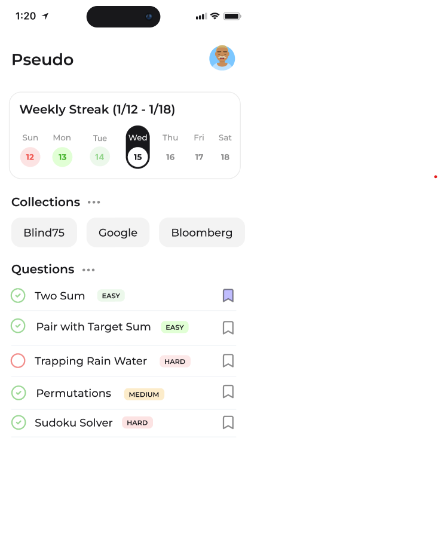
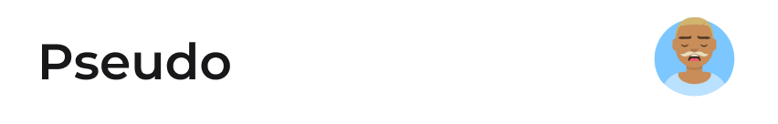
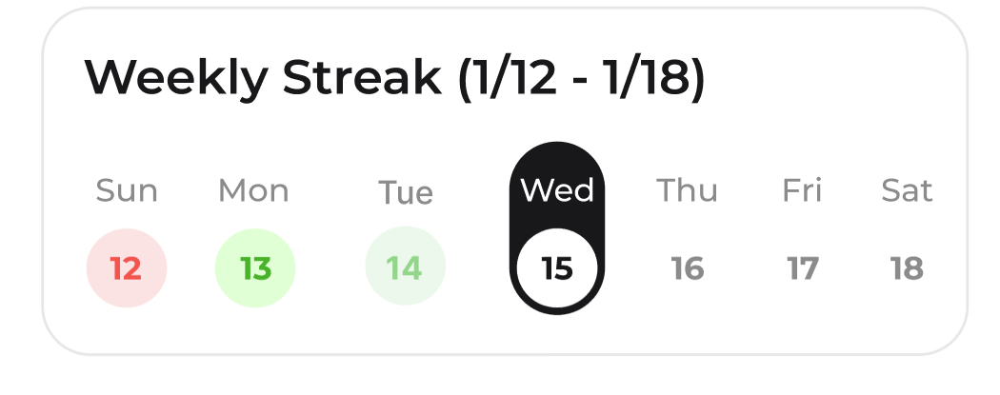
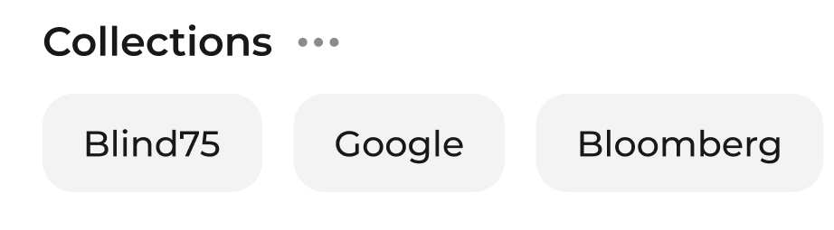
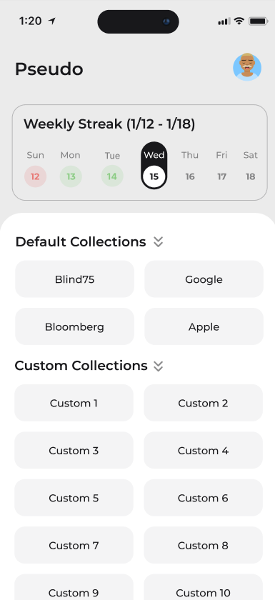
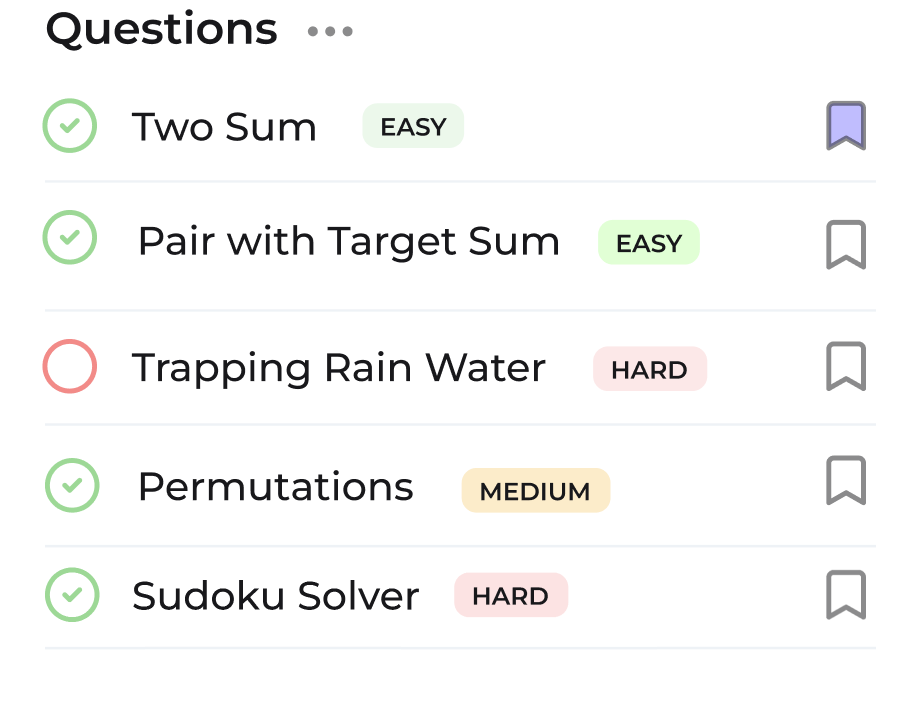
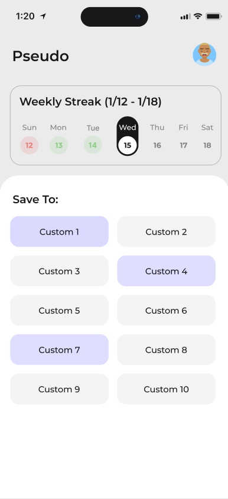

# Home Screen Documentation

## Overview
The Home Screen serves as the main interface for users to view their weekly progress, access collections, and browse questions.

## Component Details

### HomeScreen (home.tsx)
<p align="center">

</p> 

- Main container component
- Manages collectionsBottomDrawer state
- Manages saveQuestionToCollectionBottomDrawer state
- Props:
- Data Structure: 

### Header (Header.tsx)
<p align="center">

</p>

- The header component height is 50 and the width is the full width of the screen.
- Displays app title "Pseudo" and is font-montserrat, text-black, font-semibold, text-lg. The title is pressable and onPress, it redirects to the HomeScreen.
- Shows user profile avatar. The avatar is pressable and onPress, it redirects to the ProfileScreen.
- Props:
- Data Structure: 

### WeeklyStreak (WeeklyStreak.tsx)
<p align="center">

</p>

- Shows current week progress.
- The WeeklyStreak component width is 340 and the height is 130.
- The WeeklyStreak title is font-montserrat, text-black, font-semibold, text-lg.
- Visual indicators:
  - For all days, the day text is font-montserrat, text-gray-soft, text-xs. Unless it is the current day, then it is text-white.
  - For upcoming days, the day number is text-gray-soft. 
  - For the current day:
    - Both the day text and day number is grouped together in a bg-black rounded-full.
    - By default, the day number is text-black.
  - For the current day and previous days:
    - The day number has a bg-green-soft rounded-full with text-green-hard to represent a day where a question was solved
  - For previous days:
    - The day number has a bg-red-soft rounded-full with text-red-hard to represent a day where a question was not solved
- Props: None
- Data Structure:
```typescript
interface WeeklyStreak {

}
```

### Collections (Collections.tsx)
<p align="center">

</p>

- The title contains a "Collections" text and an ellipses icon.
  - The "Collections" text is font-montserrat, text-black, font-semibold, text-lg.
  - The ellipses icon is Ellipses.tsx, text-gray-soft and size 24x24.
- The ellipses icon is pressable and onPress it triggers a DropdownMenu component.
- The DropdownMenu component contains a pressable "More" button that triggers collectionsBottomDrawer.
  - The "More" button has bg-gray-soft rounded-full.
  - The "More" text is font-montserrat, text-black, text-xxs.
- Displays collection cards in a single, horizontally scrollable row.
- The individual collection cards are:
  - bg-gray-soft
  - text: font-montserrat, text-black, text-base
  - height is 50
  - width is variable depending on the text length
- Props:
- Data Structure:
```typescript
interface Collection {

}
```

### CollectionsBottomDrawer (CollectionsBottomDrawer.tsx)
<p align="center">

</p>

- The "unused" portion of the screen that is not the bottom drawer should be bg-gray-soft.
- The bottom drawer background is bg-white.
- The bottom drawer has a title "Default Collections" followed by a chevrons icon. 
  - The title is font-montserrat, text-black, font-semibold, text-lg.
  - The chevrons icon is size 24x24 is color is gray-soft.
- If "Default Collections" is expanded:
  - The chevrons icon in the title is ChevronsDown.
  - A list of collections is displayed.
  - Each collection card has a bg-gray-soft rounded-full.
  - Each collection card has a text that is font-montserrat, text-black, text-base.
- If "Default Collections" is collapsed:
  - The chevrons icon in the title is ChevronsRight.
  - A list of collections is not displayed.
- If a collection card is pressed, it redirects the user to the CollectionScreen using the collection_id.
- Props:
- Data Structure:
```typescript
interface Collection {

}
```

### Questions (Questions.tsx)
<p align="center">

</p>

- The title contains a "Questions" text and an ellipses icon.
  - The "Questions" text is font-montserrat, text-black, font-semibold, text-lg.
  - The ellipses icon is Ellipses.tsx, text-gray-soft and size 24x24.
- The ellipses icon is pressable and onPress it triggers a DropdownMenu component.
- The DropdownMenu component contains pressable buttons.
  - Both DropdownMenu buttons have bg-gray-soft rounded-full.
  - Both button texts are font-montserrat, text-black, text-xxs.
- Display a list of questions.
- Each question:
  - Has an icon to represent if the question has been solved or not.
    - A completed question is text-green-hard and uses the icon CircleCheck.
    - An incomplete question is text-red-hard and uses the icon Circle.
  - Has a title that is font-montserrat, text-black, text-base.
  - Has a difficulty badge that uses the badge.tsx component.
    - An easy badge has bg-green-soft.
    - A medium badge has bg-orange-soft.
    - A hard badge has bg-red-soft.
  - Has a pressable Bookmark icon with border-gray-soft and: 
    - is bg-blue-soft when the question has been saved to a custom collection.
    - is bg-white when the question has not been saved to a custom collection.
- Pressing the Bookmark icon triggers saveQuestionToCollectionBottomDrawer.
- Props:
- Data Structure:
```typescript

```

### SaveQuestionToCollectionBottomDrawer (SaveQuestionToCollectionBottomDrawer.tsx)
<p align="center">

</p>

- The "unused" portion of the screen that is not the bottom drawer should be bg-gray-soft.
- The bottom drawer background is bg-white.
- The bottom drawer has a title "Save To:". The title is font-montserrat, text-black, font-semibold, text-lg.
- The bottom drawer has a list of custom collections. If the custom collection already has the current question saved to, the collection card is bg-blue-soft. Otherwise, the collection card is bg-gray-soft.
- Each collection card has a text that is font-montserrat, text-black, text-base.
- If a collection card has the question saved and is pressed, the question is removed from the collection.
- If a collection card does not have the question saved and is pressed, the question is added to the collection.
- Note that the user can click multiple collection cards while in the bottom drawer. We should consider "preparing" the endpoint calls and only executing when the user exits the bottom drawer. So that we are not making endpoint calls for every press.

- Props:
- Data Structure:
```typescript
interface Collection {

}
```

## State Management

### Hooks

#### useCollectionsBottomDrawer
- 

#### useSaveQuestionToCollectionBottomDrawer
- 

#### useHomeData
- 

## Styles
- Refer to [styling.md](../styling.md) for more information on colors and typography.

## File Structure
```
TBD
```

## Changelog

### Version 1.0.0 (Initial Implementation)
Pushed to `main` on `date tbd`
- TBD

### Future Improvements
- [ ] TBD
