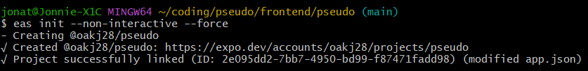

## Expo: Expo Go
ExpoGo was my go-to tool for testing the app on my phone because it was quick and easy to set up. Testing on my iPhone was as easy as `npm start` and then opening the Expo Go app on my phone.

As of 5/8/2025, we are "migrating" to EAS build for testing. We are switching because:
1. Expo 53 was released at the end of April.
2. With the release of Expo 53, my iPhone forced an Expo Go update which requires me to update my apps to Expo 53. It's not possible to (easily and conviently) downgrade to a previous version of Expo Go.
3. Upgrading to Expo 53 required upgrading to React 19.
4. Our core UI library, React Native Reusables, is not yet fully compatible with React 19. Mainly due to RNR's dependency on lucide-react-native.
5. Replacing RNR with another UI library would take a lot of time and effort.

In the end, we used Expo Go for it's convenience but it's not longer convenient. We eventually would need to migrate to EAS build for setting up a nice CI/CD pipeline and for our production builds. This just means we are prioritizing the migration now.

By migrating to EAS build, we can:
    - Use Expo 52 for our project
    - Build Expo 52 via the cloud using EAS build instead of relying on ExpoGo


## Expo: EAS Build
EAS Build is a tool that allows us to build our app for multiple platforms (Android, iOS, Web) from a single codebase. It eliminates the need for local build tools and provides consistent build environments.

Note that because EAS builds in a cloud environment, it cost ***$$$*** to run each build. We should be mindful of this when running builds.

### Prerequisites
- [X] An Expo account for EAS logins
- [X] Required global dependencies installed: ```eas-cli```
- [X] Required project-level dependencies installed: ```expo-dev-client``` and any required native modules specific to this project.

### Initial Setup
1. Configure development build profiles in `eas.json`
```json
{
  "build": {
    "development": {
      "developmentClient": true,
      "distribution": "internal"
    }
  }
}
```
2. Login to EAS via eas-cli: `eas login`

3. Initialize your EAS project:
```bash
eas init
```
   - This will:
     - Create an EAS project on Expo's servers
     - Link your local project to the EAS project
     - Configure necessary project settings
<p align="center">

</p>

4. Configure app version source (optional but recommended):
   Add to eas.json:
```json
{
  "cli": {
    "appVersionSource": "local"
  },
  "build": {
    // ... existing build config ...
  }
}
```

After completing these steps, you should be able to run `npm run build:android` successfully.

### Android
Prerequisites:
- No additional prerequisites for cloud builds
- For local builds:
  - Android Studio and development environment setup
  - Android Emulator (optional)

Build Commands:
- `eas build --platform android --profile development`
- `eas build --platform android --profile development --local` does not work because local builds are not supported on Windows machines. EAS builds

### iOS
Prerequisites:
- [ ] Apple Developer Account
    - [X] Decide if we want to enroll as an "Individual" or "Organization"
        - I originally enrolled as an "Individual" but we will change to "Organization" because:
            1. It's the same price
            2. Organizations can use alias' for the application instead of publishes with my name
    - [X] Pay $99/year
    - [ ] Accepeted as an "Individual" enrollment
    - [ ] Completed the transfer from "Individual" to "Organization"
- For local builds:
  - macOS required
  - Xcode and development environment setup

Build Commands:
- For iOS Simulator (Mac only):
    ```
    eas build --platform ios --profile development --simulator
    ```
    - Creates a build for testing on iOS Simulator on Mac
    - Faster build process, no code signing required
    - Cannot be installed on physical devices

- For Physical iOS Devices:
    ```
    eas build --platform ios --profile development
    ```
    - Creates a build for testing on real iOS devices
    - Requires Apple Developer account
    - Can be installed on your iPhone/iPad

### Build Types
1. Development Builds
   - For testing during development
   - Includes developer tools
   - Can be built for both simulator and physical devices

2. Preview Builds
   - For internal testing and QA
   - Similar to production builds but with internal distribution

3. Production Builds
   - For App Store and Play Store submission
   - Optimized for production use


## NPM Scripts
Add these scripts to your package.json:
```json
{
  "scripts": {
    "build:android": "eas build --platform android --profile development",
    "build:ios": "eas build --platform ios --profile development",
    "build:ios-simulator": "eas build --platform ios --profile development --simulator"
  }
}
```

### Notes
- Development builds only need to be rebuilt when native code changes
- The same JavaScript bundler can be used after installing the development build
- Builds can be installed via:
  - EAS CLI prompts
  - expo.dev dashboard
  - Expo Orbit
  - Direct installation for local builds

### How to Save Money Using Development Builds

Development builds on EAS cost money for each build, but you can minimize these costs by understanding when builds are necessary:

1. **When to Build**
   - First time setup of the development client
   - When adding/updating native dependencies (expo packages, native modules)
   - When changing native code configurations
   - When upgrading Expo SDK versions

2. **When NOT to Build**
   - JavaScript/TypeScript code changes
   - Style changes
   - Asset changes (images, fonts already included in the build)
   - Business logic updates

3. **Development Workflow**
   a. Initial Setup (One-time cost):
      - Run `npm run build:android` to create development client
      - Install the resulting .apk on your device
      - This build includes the development client and all native modules
   
   b. Daily Development (Free):
      - Use `npm start` to run the development server
      - Your installed development client will load new JavaScript changes
      - Changes are delivered instantly over your local network

4. **Best Practices**
   - Keep track of native dependencies in a changelog
   - Batch native dependency updates together
   - Test thoroughly in Expo Go first if possible
   - Plan SDK upgrades in advance
   - Use git tags or releases to mark builds that work well

5. **Cost Breakdown**
   - Each build costs EAS build minutes
   - Development builds are typically needed 1-2 times per month
   - Most development work uses local JavaScript bundling (free)
   - Consider scheduling major updates together to minimize builds

Remember: The development client is designed to separate native code (requiring builds) from JavaScript (instant updates). By understanding this separation, you can develop efficiently while minimizing cloud build costs.

### Future Section for Production Builds and the CI/CD Pipeline
TBD

### Unorganized Notes

EAS build uses the latest git commit to build the app. This caused an issue for us when setting up EAS builds because we never commiited the change.

***will `npx expo run:android` automatically use the latest eas build?***
If you want to install and run the latest EAS build, you have a few options:
Download the APK directly from EAS (from your build page on Expo's website) and install it:
Use the EAS CLI to download and install the latest build:
If you're using internal distribution, you can install it directly from EAS:
Remember that EAS builds (cloud builds) and local development builds (npx expo run:android) are separate build processes. The local command will always create a new build on your machine rather than using an existing EAS build.

***Does the local command use my code repository in its current state, or does it use the latest git commit?***

The local command npx expo run:android uses your code repository in its current state - exactly as it exists on your local filesystem. It will include:
All your current changes
Uncommitted changes
Untracked files
Changes that aren't pushed to git
This is different from EAS builds, which build from your git repository and require you to commit and push your changes before building.
So if you want to test local changes quickly, npx expo run:android is perfect as it will reflect exactly what's in your working directory right now, regardless of git status.

***Does `npx expo run:android` rebuild everything, including native packages?***

npx expo run:android is smart about what it rebuilds:
For JavaScript/TypeScript code:
Always rebuilds to ensure latest changes are included
Uses Metro bundler to handle the JS bundle
For native code:
Only rebuilds native modules if there are changes to native dependencies or configurations
Changes that trigger native rebuilds include:
Modifications to android/ directory
Changes to native dependencies in package.json
Changes to app.json/app.config.js
Running npx expo prebuild